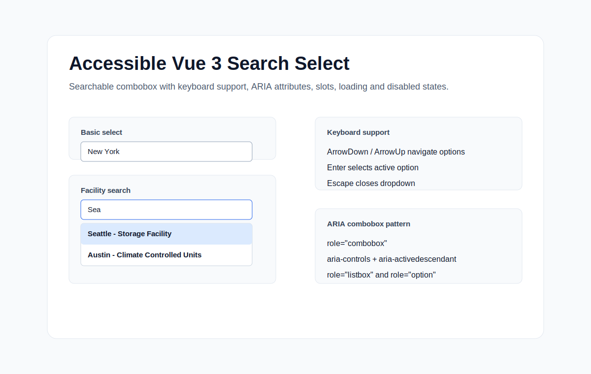

# Accessible Vue Search Select


A reusable and accessible Vue 3 combobox/listbox component built with TypeScript.

Published npm package: `@irina_grigoreva/accessible-vue-search-select`



## Features

- Vue 3.5+ component built with `<script setup lang="ts">`
- Accessible searchable combobox/listbox pattern
- `v-model` support for objects and primitive values via `emitValue`
- Teleported dropdown with optional inline listbox mode
- Loading, empty, disabled, clearable, and error states
- Light and dark mode support via CSS custom properties
- Custom option and selected-value slots
- Flexible `labelKey`, `valueKey`, and `searchKeys` mapping
- Configurable `inputId`, `listboxId`, and ARIA labels
- Stable ARIA relationships:
  - `aria-controls`
  - `aria-expanded`
  - `aria-activedescendant`
  - `aria-selected`
- Keyboard navigation support
- Vitest + Vue Test Utils coverage
- Library build with exported TypeScript types

## Demo

<video src="./demo/demo.mp4" controls autoplay loop muted playsinline></video>

Run the local demo:

```bash
npm install
npm run dev
```

Then open:

```text
http://127.0.0.1:5173/
```

The demo source is in [examples/SelectSimpleSearchDemo.vue](./examples/SelectSimpleSearchDemo.vue).

## Installation

```bash
npm install @irina_grigoreva/accessible-vue-search-select
```

Import the component and styles:

```ts
import { SelectSimpleSearch } from "@irina_grigoreva/accessible-vue-search-select";
import "@irina_grigoreva/accessible-vue-search-select/dist/accessible-vue-search-select.css";
```

For local development in this repository:

```bash
npm install
npm run typecheck
npm run test
npm run build
```

## Basic Usage

```vue
<script setup lang="ts">
import { ref } from "vue";
import { SelectSimpleSearch, type SelectOption } from "@irina_grigoreva/accessible-vue-search-select";
import "@irina_grigoreva/accessible-vue-search-select/dist/accessible-vue-search-select.css";

const selected = ref<SelectOption | null>(null);

const states = [
  { label: "California", value: "ca" },
  { label: "New York", value: "ny" },
  { label: "Texas", value: "tx" },
];
</script>

<template>
  <SelectSimpleSearch
    v-model="selected"
    label="State"
    placeholder="Choose a state"
    :options="states"
    label-key="label"
    value-key="value"
  />
</template>
```

Primitive `v-model` values:

```vue
<script setup lang="ts">
import { ref } from "vue";

const selectedState = ref<string | number | null>(null);
</script>

<template>
  <SelectSimpleSearch
    v-model="selectedState"
    emit-value
    label="State"
    :options="states"
  />
</template>
```

Facility-style objects are supported by default:

```ts
const facilities = [
  {
    id: 1,
    slug: "seattle-storage",
    public_title: "",
    address: {
      city: "Seattle",
      full_address: "8 Pine Street, Seattle, WA",
    },
  },
];
```

This renders the selected label as `Seattle - Storage Facility`.

## Props

| Prop | Type | Default | Description |
| --- | --- | --- | --- |
| `options` | `SelectOption[]` | `[]` | Options to render. |
| `modelValue` | `SelectOption \| string \| number \| null` | `null` | Selected value for `v-model`. |
| `placeholder` | `string` | `"Select an option"` | Input placeholder. |
| `type` | `string` | `"default"` | Optional compatibility class. |
| `inlineListbox` | `boolean` | `false` | Render listbox inline instead of teleporting to `body`. |
| `closeOnBlur` | `boolean` | `false` | Close after input blur. |
| `label` | `string` | `""` | Visible input label. |
| `name` | `string` | `"select-simple-search"` | Input name. |
| `inputId` | `string` | generated | Input id. |
| `listboxId` | `string` | generated | Listbox id used by `aria-controls` and option ids. |
| `ariaLabel` | `string` | `"Search options"` | Accessible label when no visible label is provided. |
| `labelKey` | `string` | `""` | Dot-path used for option labels. |
| `valueKey` | `string` | `""` | Dot-path used for option values. |
| `searchKeys` | `string[]` | common label/facility fields | Dot-path fields searched by the input. |
| `disabled` | `boolean` | `false` | Disable the component. |
| `clearable` | `boolean` | `true` | Show clear button when selected. |
| `clearLabel` | `string` | `"Clear selection"` | Clear button accessible label. |
| `noResultsText` | `string` | `"No results found"` | Empty state text. |
| `loading` | `boolean` | `false` | Show loading state. |
| `loadingText` | `string` | `"Loading options..."` | Loading state text. |
| `maxHeight` | `string` | `"18rem"` | Dropdown max height. |
| `dropdownClass` | `string` | `""` | Extra dropdown class. |
| `optionClass` | `string` | `""` | Extra option class. |
| `hasError` | `boolean` | `false` | Apply error styling and `aria-invalid`. |
| `facilityFallbackLabel` | `string` | `"Storage Facility"` | Fallback title for legacy facility options without `public_title`. |
| `emitValue` | `boolean` | `false` | Emit option value instead of the whole option object. |
| `sortOptions` | `boolean` | `false` | Sort filtered options alphabetically by display label. |

## Emits

| Event | Payload | Description |
| --- | --- | --- |
| `update:modelValue` | `SelectOption \| string \| number \| null` | Emitted for `v-model`. |
| `change` | `SelectOption \| string \| number \| null` | Emitted when selection changes. |
| `blur` | none | Emitted after input blur handling. |
| `clear` | none | Emitted when selection is cleared. |
| `open` | none | Emitted when listbox opens. |
| `close` | none | Emitted when listbox closes. |

## Slots

| Slot | Props | Description |
| --- | --- | --- |
| `option` | `{ option, selected, active }` | Custom option rendering. |
| `selected` | `{ option }` | Custom selected-value rendering. |
| `no-results` | none | Custom empty state. |
| `loading` | none | Custom loading state. |

Example:

```vue
<SelectSimpleSearch v-model="facility" :options="facilities">
  <template #option="{ option, active, selected }">
    <div :class="{ active, selected }">
      <strong>{{ option.address?.city }}</strong>
      <span>{{ option.public_title || "Storage Facility" }}</span>
      <small>{{ option.address?.full_address }}</small>
    </div>
  </template>
</SelectSimpleSearch>
```

## Accessibility

The component keeps DOM focus on the input and uses `aria-activedescendant` for active-option tracking. The input exposes `role="combobox"`, `aria-expanded`, `aria-controls`, `aria-autocomplete="list"`, and `aria-haspopup="listbox"`.

When open, the listbox exists in the DOM with `role="listbox"`. Each option has `role="option"`, a stable `id`, and `aria-selected="true"` or `aria-selected="false"`.

For best screen reader support, pass either a visible `label` or an `ariaLabel`.

## Dark Mode

The component supports dark mode automatically through `prefers-color-scheme`. You can also force a theme by setting `data-theme` on any parent:

```html
<div data-theme="dark">
  <SelectSimpleSearch />
</div>
```

Theme colors are exposed as CSS custom properties on `.select-simple`, so design systems can override them:

```css
.select-simple {
  --select-simple-bg: #ffffff;
  --select-simple-text: #111827;
  --select-simple-border: #9ca3af;
  --select-simple-option-active-bg: #eff6ff;
  --select-simple-option-selected-bg: #dbeafe;
}
```

## Keyboard Support

| Key | Behavior |
| --- | --- |
| `ArrowDown` | Opens the listbox or moves to the next enabled option. |
| `ArrowUp` | Opens the listbox or moves to the previous enabled option. |
| `Enter` | Selects the active option while the listbox is open. |
| `Escape` | Closes the listbox and returns focus to the input. |
| `Backspace` / `Delete` | Clears the selected value when the selected label is shown. |
| `Home` / `End` | Preserve native text-input caret behavior. |

## License

MIT

## Publishing

Do not publish before running the full package verification:

```bash
npm run lint
npm run typecheck
npm run test
npm run build
npm pack --dry-run
```

Publish manually when the package contents look correct:

```bash
npm login
npm publish --access public
```

The package is configured to publish only:

- `dist`
- `README.md`
- `LICENSE`
- `package.json`
